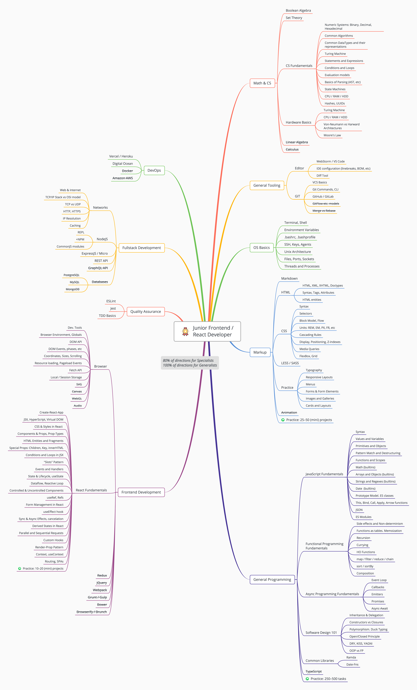
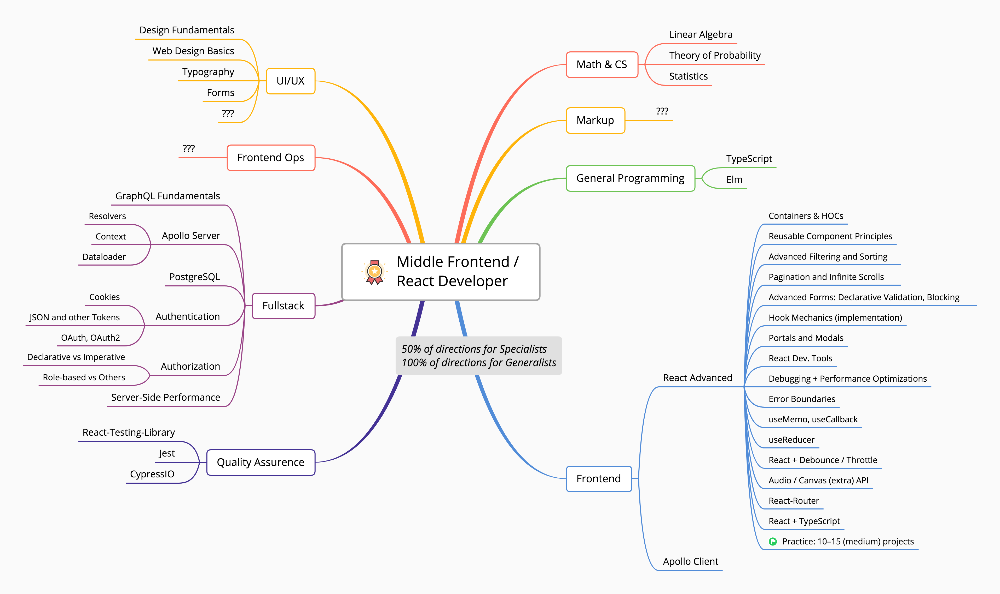
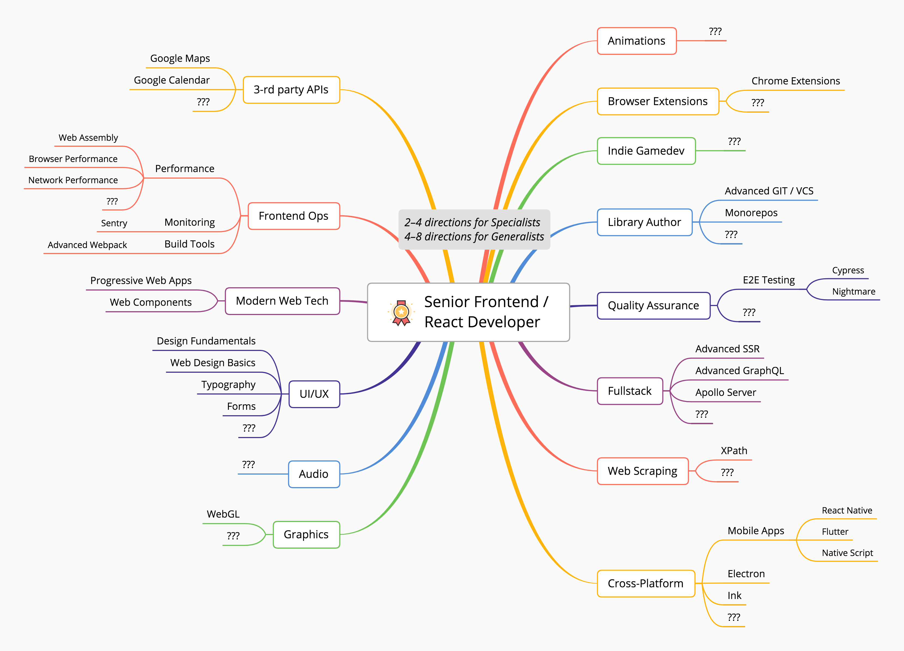

#This is a collection of MindMap to Become a FullStack Developer And Specialised For Front-End Developer;

`Scroll Down For The Original Repository Posted By  adam-golab and ivan-kleshnin `

# Mind Map For Full Stack/ Front End Developers In 2020 By Hemant (Feel Free To Follow And Star Me on Github)
 

`Please ★ this repo to show you care about the further updates.`

##Full Stack Mind Map.

1. Front-End Basic.

[**Front End -Full Stack**](frontenddev.png?raw=true)(image)

2. Back-End Basic.

[**Back End -Full Stack**](frontenddev.png?raw=true)(image)

3. Dev-Ops Basic.

[**Dev Ops -Full Stack**](devops.png?raw=true)(image)

## Dedicated Front End Mind Map.

 1. Junior Frontend Developer
[**Junior Frontend Developer**](junior.png?raw=true) (image)

2. Middle Frontend Developer
[**Middle Frontend Developer**](middle.png?raw=true) (image)
3. Senior Frontend Developer
[**Senior Frontend Developer**](senior.png?raw=true) (image)

 
 
 1.
>Hey Dev's out there this is a mindmap form basic to advance if you wish to you can pick your topic from  the map and search them randomly on youtube and study then one by one which will be time saving and a lot helpfull. 

2.
>I will suggest you to make a todo list with all the tasks you got to do and work on them one by one and fork this repo to make sure you have your own mindmap of developer.

3.
>Thank you and if this was helpful scroll below and check for original repo and feel free to star and fork them.

##Front End MindMap

##Full Stack MindMap

#Thank You Beautiful People.

#License

This content is distributed under CCA v3 license: https://creativecommons.org/licenses/by/3.0/deed.en (added a note to the original repo).

###Original Frontend Mindmap.

Github Repo : https://github.com/ivan-kleshnin/frontend-mindmaps

GitHub User (Frontend By) : https://github.com/ivan-kleshnin

###Original FullStack Mindmap.

Github Repo: https://github.com/adam-golab/react-developer-roadmap

GitHub User (Full Stack By) : ivan-kleshnin

`Clonning Url https://www.freecodecamp.org/news/2019-web-developer-roadmap/ `

##Note
This repo is not to reflect copying of content , this is created to help my friends and me in collection of best MindMaps of Front-End And Full Stack.

